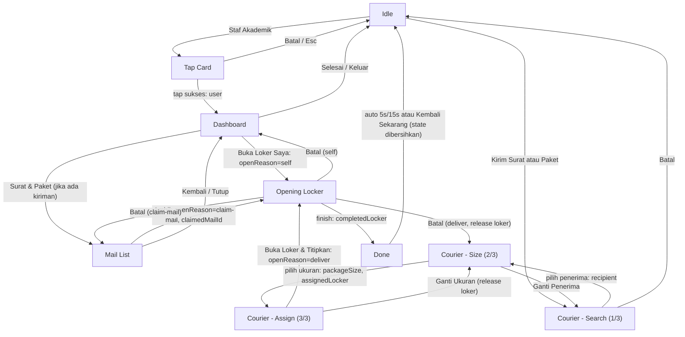

# Screen Relationships

> Navigation map with the state passed on each edge. Generated 11 Jul 2026.

## Navigation map

Cross-cutting (not drawn): from any non-idle screen, the 60 s inactivity
timeout returns to Idle, clearing all state and releasing a reserved locker
if the courier flow was abandoned.

## Edges and state passed

| From | To | Trigger | State written |
|---|---|---|---|
| Idle | Tap Card | CTA "Staf Akademik" | — |
| Idle | Courier Search | CTA "Kirim Surat atau Paket" | — |
| Tap Card | Dashboard | Successful tap | `user` |
| Tap Card | Idle | "Batal" / Escape | — |
| Dashboard | Opening Locker | "Buka Loker Saya" | `openReason: "self"` |
| Dashboard | Mail List | "Surat & Paket" (enabled if mail > 0) | — |
| Dashboard | Idle | "Selesai" tile | — (state cleared later) |
| Mail List | Opening Locker | "Ambil" on an item | `openReason: "claim-mail"`, `claimedMailId` |
| Mail List | Dashboard | "Kembali" / "Tutup" | — |
| Courier Search | Courier Size | Row tap | `recipient` |
| Courier Search | Idle | "Batal" | — |
| Courier Size | Courier Assign | Enabled size tile | `packageSize`, `assignedLocker` |
| Courier Size | Courier Search | "Ganti Penerima" | — |
| Courier Assign | Opening Locker | "Buka Loker & Titipkan" | `openReason: "deliver"` (locker already reserved) |
| Courier Assign | Courier Size | "Ganti Ukuran" | `assignedLocker: null` (+ locker released) |
| Opening Locker | Done | Primary button or countdown 0 | `completedLocker` (+ data mutations by reason) |
| Opening Locker | Dashboard | "Batal" (self) | `openReason: null` |
| Opening Locker | Mail List | "Batal" (claim-mail) | `claimedMailId: null`, `openReason: null` |
| Opening Locker | Courier Size | "Batal" (deliver) | `assignedLocker: null`, `openReason: null` (+ locker released) |
| Done | Idle | Auto-return / "Kembali Sekarang" | Entire session state cleared |
| any non-idle | Idle | 60 s inactivity | Entire session state cleared (+ reserved locker released) |

## Guard redirects (direct-navigation protection)

| Screen | Guard | Redirect |
|---|---|---|
| Dashboard, Mail List | No `user` | Idle |
| Courier Size | No `recipient` | Courier Search |
| Courier Assign | Missing `recipient`/`packageSize`/`assignedLocker` | Courier Search |
| Opening Locker | Target locker unresolvable | Idle |

## Data coupling

- A completed **deliver** flow inserts a mail item; the recipient's next
  Dashboard/Mail List load reflects it immediately.
- A completed **claim-mail** flow removes the item and may free the locker,
  which changes Courier Size availability counts and the Assign map.
- Locker reservation (Assign mount) immediately reduces the free count
  shown on Courier Search's foot strip and Courier Size tiles.
